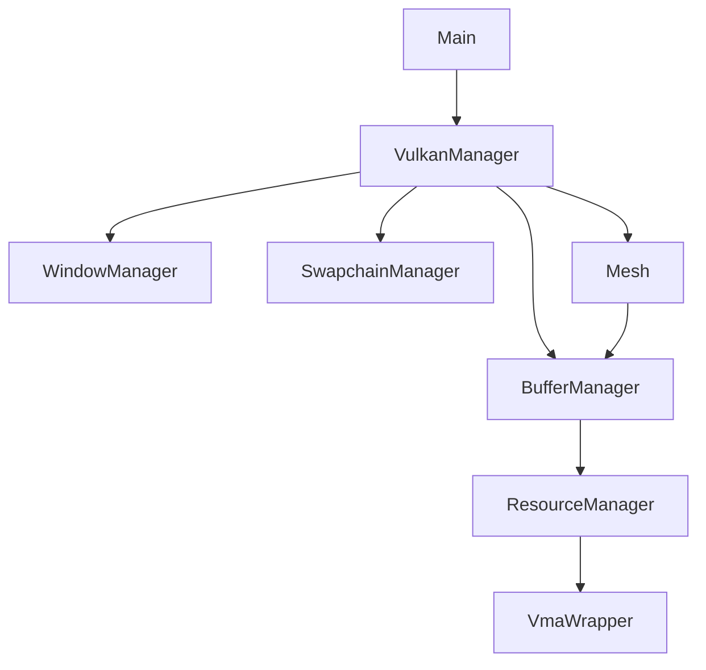

# 🏗️ Arquitetura do Motor

O **Speed Racer** utiliza uma arquitetura modular onde cada componente do Vulkan é gerenciado por uma classe especializada. O objetivo é evitar o "God Object" e facilitar a manutenção do estado da API.

---

## 🔄 Fluxo de Inicialização

A inicialização é coordenada pela classe `VulkanManager` e segue esta ordem de dependência:

1.  **Window & Instance**: Criação da janela via GLFW e da instância Vulkan.
2.  **Physical & Logical Device**: Seleção da GPU e criação das filas (Graphics, Present).
3.  **Swapchain**: Configuração das imagens onde o resultado será apresentado.
4.  **Memory & Resources**: Inicialização do VMA (`VmaWrapper`) e do `ResourceManager`.
5.  **Pipeline**: Criação do `RenderPass` e do `GraphicsPipeline`.
6.  **Commands**: Configuração do `CommandPool` e alocação de `CommandBuffers`.
7.  **Sync**: Criação de Semaphores e Fences para controle de frames em voo.

---

## 🧩 Componentes Principais

### `VulkanManager` (Orchestrator)
É a classe central. Ela mantém o ciclo de vida da aplicação (`run`, `mainLoop`, `cleanup`) e coordena a comunicação entre os managers.

### `BufferManager` & `ResourceManager`
Responsáveis por abstrair a criação de memória. Em vez de lidar com `VkBuffer` diretamente, o sistema usa `BufferHandle` (IDs numéricos), o que aumenta a segurança e desacopla a lógica.

### `Mesh`
Abstração de alto nível para geometria. Um objeto `Mesh` contém os dados da GPU (vértices e índices) e fornece métodos simples como `bind` e `draw`.

### `SwapchainManager`
Gerencia a criação e a recreação (em caso de redimensionamento da janela) das imagens de saída e seus ImageViews.

### `PipelineManager`
Fábrica estática para a criação de pipelines gráficos, isolando a complexidade das `VkGraphicsPipelineCreateInfo`.

---

## 📉 Diagrama de Dependências (Simplificado)

