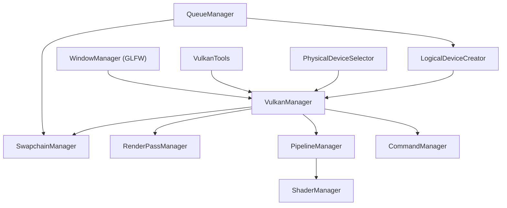
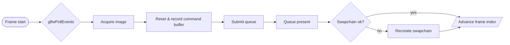

# Speedwagon — Auditoria Técnica

## 1. Visão Geral
- Motor Vulkan em estágio inicial focado em renderizar um triângulo colorido com swapchain, pipeline básico e loop funcional descritos como 25% do roadmap atual (readme.md:15, readme.md:26).
- Código em C++ (~1.3k SLOC) centralizado em `src/core` e entrada em `src/app/main.cpp` instanciando `VulkanManager::run()`; shaders escritos em GLSL para o triângulo (CMakeLists.txt:11, src/app/main.cpp:6, assets/shaders/core/basic.vert:1).
- Dependências diretas: Vulkan SDK, GLFW, GL, X11, pthread, dl e assimp conforme o alvo CMake (CMakeLists.txt:33).
- Estrutura de pastas prioriza `include/core`, `src/core`, `assets/shaders`, `libs/*` e scripts em `tools/`, sem diretórios de gameplay ou editor (arvore.txt:1).
- Roadmap aponta módulos críticos ainda não implementados (ResourceManager, BufferManager, AssetManager) permanecendo como itens pendentes (readme.md:132, readme.md:153).
- Cobertura de testes inexistente: o build apenas ativa CTest sem declarar `add_test`, nem há pasta de testes dedicada (CMakeLists.txt:45).

## 2. Arquitetura e Módulos

- **Core (VulkanManager)**: orquestra instância, dispositivo, swapchain, pipeline, comandos e sincronização em ordem fixa dentro de `initVulkan()` e `drawFrame()` (src/core/VulkanManager.cpp:35, src/core/VulkanManager.cpp:83).
- **VulkanTools**: encapsula validação e debug messenger, habilitado automaticamente fora de NDEBUG (include/core/VulkanUtils/VulkanTools.hpp:11, src/core/VulkanTools/VulkanTools.cpp:3).
- **Gerência de dispositivos**: `PhysicalDeviceSelector` valida filas e swapchain; `LogicalDeviceCreator` cria filas gráficas/presentes com base no `QueueManager` (src/core/physicalDevice.cpp:15, src/core/logicalDevice.cpp:11).
- **Queue/Command**: `QueueManager` encontra famílias e valida requisitos, enquanto `CommandManager` cria command pool resetável para a fila gráfica (src/core/queueManager.cpp:3, src/core/CommandManager.cpp:14).
- **SwapchainManager**: controla formatos, modos, framebuffers e recriação sob resize, delegando `vkDeviceWaitIdle` durante a troca (src/core/SwapchainManager.cpp:54, src/core/SwapchainManager.cpp:263).
- **RenderPass/Pipeline**: `RenderPassManager` expõe apenas um render pass color-only; `PipelineManager` monta pipeline fixo com shaders hardcoded (src/core/RenderPassManager.cpp:4, src/core/PipelineManager.cpp:4).
- **Window/Input**: `WindowManager` encapsula janela e eventos GLFW, inclusive callback de resize (src/core/WindowManager.cpp:11, src/core/VulkanManager.cpp:51).
- **Shaders**: `ShaderManager` lê arquivos binários, mas a API declarada `loadShaderModule` permanece sem implementação (include/core/ShaderManager.hpp:16, src/core/ShaderManager.cpp:4).
- **Módulos ausentes**: Math, ECS/Scene, Assets, Audio, Physics, Tools/Editor avançados e Scripting estão **NÃO ENCONTRADO**, confirmando arquitetura monolítica centrada no `VulkanManager` (src/app/main.cpp:6).
- **Estilo de arquitetura**: abordagem procedural/monolítica; não há sinais de ECS ou SceneTree, apenas controle direto da renderização (src/core/VulkanManager.cpp:340).

## 3. Pipeline de Renderização e Shaders
- **Backend**: Vulkan nativo, linkado via `Vulkan::Vulkan` e dependências de plataforma (CMakeLists.txt:33).
- **Caminho de render**: forward pass único com clear e `vkCmdDraw` de 3 vértices, sem depth ou multi-pass; viewport/scissor dinâmicos setados por frame (src/core/RenderPassManager.cpp:4, src/core/VulkanManager.cpp:205, src/core/VulkanManager.cpp:226).
- **Swapchain/framegraph**: criação baseada no suporte da GPU e recriação sob `VK_ERROR_OUT_OF_DATE_KHR`, porém `vkDeviceWaitIdle` bloqueia pipeline em cada resize (src/core/VulkanManager.cpp:62, src/core/SwapchainManager.cpp:266).
- **Comandos e sincronização**: dupla de semáforos e fences com `MAX_FRAMES_IN_FLIGHT = 2`, reciclando command buffers resetáveis (src/core/VulkanManager.cpp:158, src/core/VulkanManager.cpp:244).
- **Organização de shaders**: pipeline espera SPIR-V precompilado em `../assets/shaders/core/compiled/*.spv`, mas o repositório contém apenas GLSL fonte (`basic.vert`/`basic.frag`) sem build step para compilação (src/core/PipelineManager.cpp:8, assets/shaders/core/basic.vert:1).
- **Gargalos/Riscos**: caminhos de shader hardcoded quebram em builds fora da árvore esperada; ausência de cache/descriptors impede expansão; `vkDeviceWaitIdle` on resize e ausência de framegraph limitam escalabilidade (src/core/PipelineManager.cpp:8, src/core/VulkanManager.cpp:74).
- **Sugestões**: introduzir AssetManager + pipeline de compilação SPIR-V (glslc/shaderc), encapsular estados em um FrameGraph simples, armazenar PSO cache e normalizar paths via raiz configurável.

## 4. ECS / Cena / Game Loop
- Loop principal bloqueante: `mainLoop()` apenas chama `pollEvents()` e `drawFrame()` enquanto a janela estiver aberta; sem camadas de sistemas ou cenas (src/core/VulkanManager.cpp:340).
- `drawFrame()` executa sequência Acquire → reset/record → submit → present, aguardando fence antes de cada frame e reiniciando se o swapchain invalida (src/core/VulkanManager.cpp:83, src/core/VulkanManager.cpp:145).
- Não há ECS, SceneTree ou abstrações de gameplay; toda lógica potencial ficaria no `VulkanManager` ou em futuras extensões **NÃO ENCONTRADO** (src/app/main.cpp:6).


## 5. Plataforma, Build e Ferramentas
- Build system único em CMake, gera executável `Speed_Racer` com flags de debug forçadas (`-g -O0`) (CMakeLists.txt:6, CMakeLists.txt:11).
- Passos reproduzíveis:
```bash
cmake -S . -B build
cmake --build build
./build/Speed_Racer
```
- Scripts auxiliares `tools/build_and_run.sh` e `tools/run.sh` encapsulam o fluxo, mas assumem ambiente Unix e build prévio (tools/build_and_run.sh:4, tools/run.sh:3).
- Sem integração contínua configurada; nenhum workflow ou configuração de CI presente (**NÃO ENCONTRADO**).
- Setup local exige depender das libs vendorizadas (GLFW, GLM, ImGui) dentro de `libs/`, sem scripts de fetch externos (arvore.txt:31).

## 6. Qualidade de Código
- Estilo consistente em C++ moderno simples, mas sem linters/formatadores configurados (NÃO ENCONTRADO).
- **Hotspots**: `VulkanManager` concentra 400+ linhas e múltiplas responsabilidades (src/core/VulkanManager.cpp:35); `SwapchainManager` mistura consulta, criação e logging (src/core/SwapchainManager.cpp:54); `PipelineManager` fixa paths e ignora configuração do `PipelineConfig` (src/core/PipelineManager.cpp:4); `LogicalDeviceCreator` pede todas as filas disponíveis sem filtrar uso real (src/core/logicalDevice.cpp:11); `QueueManager` usa mapa denso e assume presentes para compute/transfer (src/core/queueManager.cpp:16).
- Tratamento de erros: predominância de `throw std::runtime_error`, sem códigos específicos ou logs estruturados (ex.: src/core/SwapchainManager.cpp:157, src/core/CommandManager.cpp:24).
- RAII parcial via `std::unique_ptr`, porém `PipelineManager::createGraphicsPipeline` deixa `VkPipelineLayout` ativo até cleanup explícito (src/core/VulkanManager.cpp:366).
- Função `ShaderManager::loadShaderModule` declarada e não implementada pode induzir chamadas inválidas futuras (include/core/ShaderManager.hpp:16).
- Sem testes automatizados ou validação pós-build, apesar de `enable_testing()` (CMakeLists.txt:45).

## 7. Assets e Pipeline de Dados
- Assets limitam-se a shaders GLSL embutidos em arrays locais; não há texturas, modelos ou dados externos (assets/shaders/core/basic.vert:5, assets/shaders/core/basic.frag:3).
- Ausência de AssetManager, registries ou hot-reload; roadmap sugere futura implementação, porém ainda **NÃO ENCONTRADO** (readme.md:145).
- Não há uso de Git LFS ou versionamento específico para assets (arvore.txt:1).

## 8. Performance e Memória
- `vkDeviceWaitIdle` durante recriação do swapchain bloqueia toda a GPU; poderia ser trocado por sincronização de fences por imagem (src/core/SwapchainManager.cpp:266).
- `LogicalDeviceCreator` solicita todas as filas disponíveis, aumentando consumo de recursos sem uso imediato (src/core/logicalDevice.cpp:19).
- Renderização e submissão permanecem single-threaded, com esperas de fence por frame (src/core/VulkanManager.cpp:84); não há double-buffering de recursos ou job system.
- Sugestões: limitar `queueCount` ao necessário, adiar `vkDeviceWaitIdle`, preparar alocadores para buffers persistentes e considerar um job system simples para tarefas de upload.

## 9. Licenças e Compliance
- Projeto licenciado sob GPL-3.0 (LICENSE:1).
- Terceiros vendorizados: GLFW (zlib/libpng) (libs/glfw/LICENSE.md:1), GLM (MIT/Happy Bunny) (libs/glm/copying.txt:1) e Dear ImGui (MIT) (libs/imgui/LICENSE.txt:1).
- `assimp` é linkado dinamicamente mas não vendorizado; garantir conformidade BSD-3 ao distribuir binários.
- Faltam arquivos NOTICE/THIRD_PARTY detalhando obrigações de redistribuição (**NÃO ENCONTRADO**).

## 10. Roadmap Sugerido
- **Quick Wins (1–2 semanas):** normalizar paths de shaders via AssetManager e gerar SPIR-V durante o build; implementar `ShaderManager::loadShaderModule`; adicionar teste de fumaça criando `VulkanManager` em modo headless.
- **30 dias:** quebrar responsabilidades do `VulkanManager` em subsistemas (Device, RenderLoop, Resource); integrar PipelineBuilder/ResourceManager conforme checklist; substituir waits globais por sincronização por imagem.
- **60 dias:** introduzir AssetManager com cache e watchers; criar camada de abstração para buffers/uniforms; iniciar sistema de cenas ou estrutura ECS básica.
- **90 dias:** expandir renderização (UBOs, meshes) com framegraph simples; automatizar builds (CI) e validar em múltiplas plataformas; preparar ferramentas (editor/debug HUD).
- **Riscos/Blockers:** inexistência de Asset pipeline e compilação de shaders (quebra build); acoplamento extremo no `VulkanManager`; ausência de testes pode mascarar regressões.

## 11. Questões para o Autor
- Qual é o plano para gerar/armazenar os binários SPIR-V exigidos por `PipelineManager`?
- Há preferência por AssetManager central vs. múltiplos loaders especializados?
- O roadmap prevê integração de ECS ou abordagem orientada a objetos para cenas?
- Alguma restrição de plataforma/OS além de Linux desktop?
- Existe expectativa de manter GPL-3.0 ou considerar relicenciamento para facilitar uso de libs MIT?

## 12. Apêndices
| Módulo | Linguagem | ~SLOC | Principais arquivos | Última modificação | Dependências | Observações |
| --- | --- | --- | --- | --- | --- | --- |
| Core (VulkanManager) | C++ | 407 | src/core/VulkanManager.cpp | 2025-10-13¹ | Vulkan, GLFW | Coordena todo o ciclo Vulkan, concentrando responsabilidades (src/core/VulkanManager.cpp:35).
| VulkanTools | C++ | 92 | src/core/VulkanTools/VulkanTools.cpp | 2025-10-12¹ | Vulkan | Encapsula validation layers e debug messenger (src/core/VulkanTools/VulkanTools.cpp:23).
| Device (Physical/Logical/Queue) | C++ | 185 | src/core/physicalDevice.cpp; src/core/logicalDevice.cpp; src/core/queueManager.cpp | 2025-10-12¹ | Vulkan | Seleção de GPU, criação de device e filas (src/core/logicalDevice.cpp:11).
| Swapchain | C++ | 276 | src/core/SwapchainManager.cpp | 2025-10-13¹ | Vulkan, GLFW | Gerencia swapchain, image views e framebuffers (src/core/SwapchainManager.cpp:54).
| Rendering Pipeline | C++ | 187 | src/core/PipelineManager.cpp | 2025-10-12¹ | Vulkan | Paths de shader hardcoded a arquivos inexistentes (src/core/PipelineManager.cpp:8).
| RenderPass | C++ | 51 | src/core/RenderPassManager.cpp | 2025-10-12¹ | Vulkan | Render pass color-only com dependency simples (src/core/RenderPassManager.cpp:4).
| ShaderManager | C++ | 40 | src/core/ShaderManager.cpp | 2025-10-12¹ | Vulkan | Falta implementação de `loadShaderModule` (include/core/ShaderManager.hpp:16).
| Window/Input | C++ | 62 | src/core/WindowManager.cpp | 2025-10-13¹ | GLFW | Janela, eventos e surface creation (src/core/WindowManager.cpp:24).
| Command | C++ | 53 | src/core/CommandManager.cpp | 2025-10-12¹ | Vulkan | Command pool resetável para fila gráfica (src/core/CommandManager.cpp:14).
| App Entry | C++ | 15 | src/app/main.cpp | 2025-10-12¹ | Core | Instancia `VulkanManager` e trata exceções (src/app/main.cpp:6).
| Math | — | — | — | — | — | **NÃO ENCONTRADO**.
| ECS/Scene | — | — | — | — | — | **NÃO ENCONTRADO**.
| Assets | — | — | — | — | — | Apenas GLSL em `assets/shaders` (assets/shaders/core/basic.vert:5).
| Audio | — | — | — | — | — | **NÃO ENCONTRADO**.
| Physics | — | — | — | — | — | **NÃO ENCONTRADO**.
| Tools/Editor | Shell | — | tools/build_and_run.sh | 2025-10-12¹ | CMake | Scripts básicos de build/run (tools/build_and_run.sh:4).
| Scripting | — | — | — | — | — | **NÃO ENCONTRADO**.

¹Datas obtidas via metadados de arquivo (`stat`).

| Lib | Versão (se detectável) | Onde usada | Licença | Risco |
| --- | --- | --- | --- | --- |
| Vulkan SDK | not_found | Backend gráfico principal (CMakeLists.txt:33) | Proprietária/SDK | Exige drivers/SDK instalados.
| GLFW | bundled | Criação de janela/surface (src/core/WindowManager.cpp:24) | zlib/libpng (libs/glfw/LICENSE.md:1) | Manter atualização manual da cópia vendorizada.
| GLM | bundled | `libs/glm` (não usado ainda) | MIT/Happy Bunny (libs/glm/copying.txt:1) | Peso extra não utilizado.
| Dear ImGui | bundled | `libs/imgui` (não referenciado) | MIT (libs/imgui/LICENSE.txt:1) | Sem integração; risco de drift.
| Assimp | system | Linkado no executável (CMakeLists.txt:40) | BSD-3 | Não utilizado/validação ausente.

**Excertos críticos**
```cpp
// PipelineManager.cpp
auto vertShaderCode = ShaderManager::readFile("../assets/shaders/core/compiled/vert.spv");
auto fragShaderCode = ShaderManager::readFile("../assets/shaders/core/compiled/frag.spv");
```
(src/core/PipelineManager.cpp:8)

```cpp
while (!window.shouldClose()) {
    window.pollEvents();
    drawFrame();
}
```
(src/core/VulkanManager.cpp:340)

```json
{
  "project_name": "Speed Racer Engine",
  "languages": ["C++", "GLSL", "Shell"],
  "build": {
    "system": "CMake",
    "commands": ["cmake -S . -B build", "cmake --build build"],
    "profiles": ["Debug"],
    "ci": {"provider": "not_found", "status": "not_found"}
  },
  "architecture": {
    "style": "Monolithic",
    "modules": [
      {"name": "core", "sloc": 407, "deps": ["Vulkan", "GLFW"]},
      {"name": "rendering", "sloc": 187, "backend": "Vulkan", "shaders": ["GLSL"]},
      {"name": "ecs_or_scene", "details": "not_found"},
      {"name": "physics", "engine": "not_found"},
      {"name": "assets", "format": "not_found"},
      {"name": "input", "details": "GLFW window events"},
      {"name": "audio", "details": "not_found"},
      {"name": "scripting", "lang": "none"}
    ]
  },
  "quality": {
    "linters": [],
    "tests": {"framework": "none", "count": 0},
    "hotspots": [
      {"file": "src/core/VulkanManager.cpp", "reason": "god_object"},
      {"file": "src/core/PipelineManager.cpp", "reason": "hardcoded_shader_paths"}
    ]
  },
  "performance": {
    "suspicions": ["device_wait_idle_on_resize", "single_queue_submission"],
    "recommendations": ["framegraph", "job_system", "pipeline_cache"]
  },
  "licenses": {
    "project": "GPL-3.0",
    "third_party": [
      {"lib": "GLFW", "license": "zlib"},
      {"lib": "GLM", "license": "MIT"},
      {"lib": "Dear ImGui", "license": "MIT"},
      {"lib": "Assimp", "license": "BSD-3"}
    ],
    "risks": ["Ensure redistribution complies with GPL-3.0 obligations"]
  },
  "roadmap": {
    "quick_wins": [
      "Normalize shader paths and add SPIR-V compilation",
      "Implement ShaderManager::loadShaderModule",
      "Add smoke test for VulkanManager init"
    ],
    "30_days": [
      "Split VulkanManager into focused subsystems",
      "Introduce ResourceManager/BufferManager",
      "Replace vkDeviceWaitIdle with per-image sync"
    ],
    "60_days": [
      "Add AssetManager with caching",
      "Create buffer abstraction for meshes",
      "Prototype scene graph or ECS"
    ],
    "90_days": [
      "Build simple framegraph and descriptor strategy",
      "Automate CI builds across platforms",
      "Integrate debug/editor tooling"
    ],
    "blockers": [
      "Missing shader binaries",
      "High coupling in VulkanManager",
      "Lack of automated validation"
    ]
  },
  "questions_for_author": [
    "How will SPIR-V binaries be generated and stored?",
    "Should AssetManager centralize all file access or remain modular?",
    "Is an ECS planned or will scenes remain object-oriented?",
    "Which target platforms must be supported beyond Linux?",
    "Is GPL-3.0 the definitive license choice?"
  ]
}
